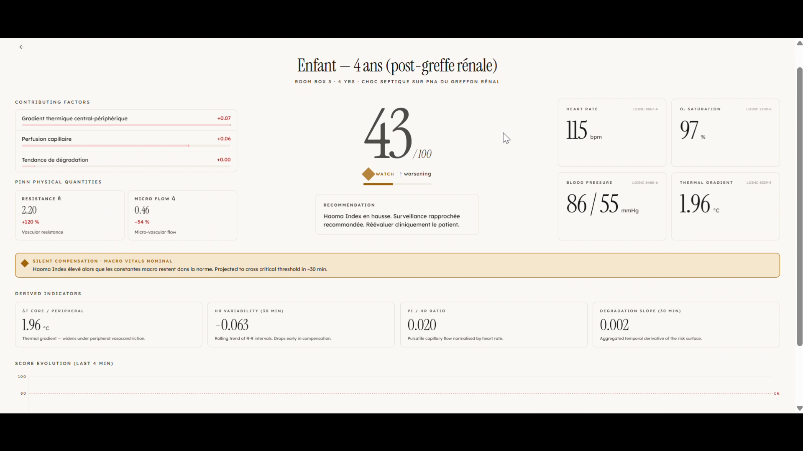
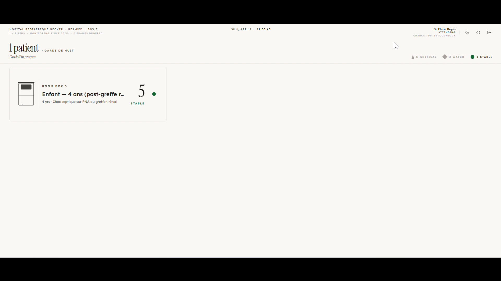
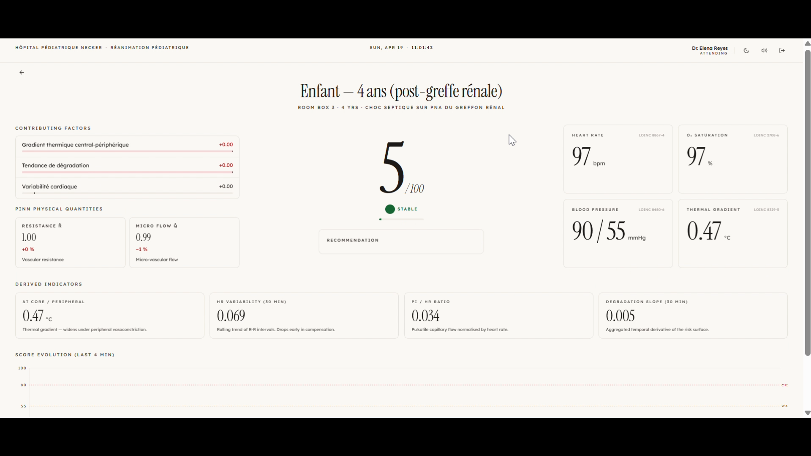
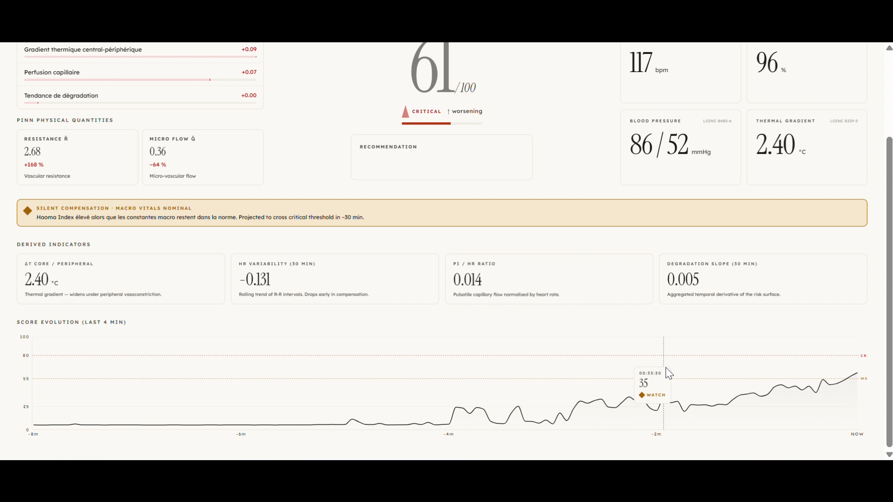
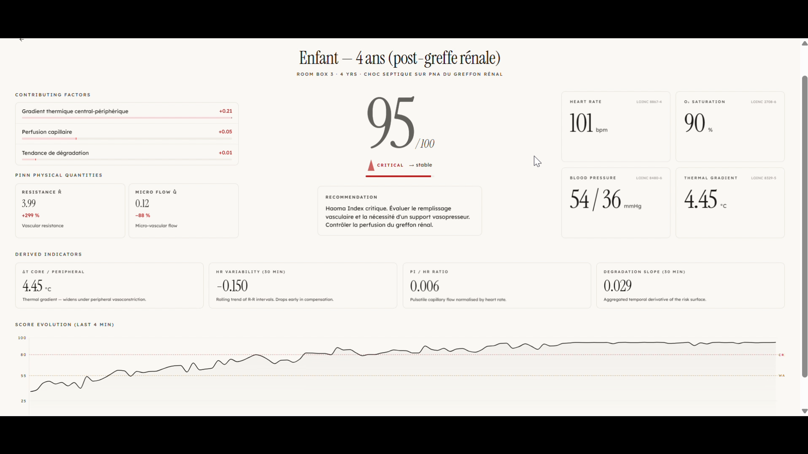

# Haoma

> Detecting vascular collapse in critically ill children — **hours before vital signs show anything is wrong.**



*The thesis in one screen. Haoma Index at 43/100, trajectory worsening — while heart rate, SpO₂ and blood pressure still read within their reference ranges. This is the window Haoma is built to surface.*

🎥 **Watch the demo:** [Haoma — MIT Hacking Medicine Paris 2026](https://youtu.be/erOHuP-XyNI)

## The problem Haoma addresses

In a pediatric ICU, a deteriorating child is often *visibly stable* long after their smallest blood vessels have started to fail. Heart rate, blood pressure and oxygen saturation — the vitals everyone watches — only move **once compensation has already been exhausted**. By then, the window where treatment is cheapest and most effective has closed.

Two realities shape the context:

- The World Health Organization estimates that **roughly 1 in 10 patients is harmed during hospital care** in high-income countries, and that **about half of those harms are preventable**. In low- and middle-income countries, patient harm contributes to an estimated **2.6 million deaths per year**.[^who-safety]
- Sepsis remains one of the leading causes of death in children worldwide; pediatric ICU care is where the outcome is decided, and where subtle early physiological drift is clinically most informative.[^rudd-sepsis]

Haoma targets the **silent compensation phase** specifically — the hours during which a child is *actively compensating* for a failing microcirculation, while every macroscopic vital sign still reads green.

## What Haoma brings to the bedside

Haoma reads the data the monitor is already collecting (heart rate, SpO₂, blood pressure, central and peripheral temperature, perfusion index, respiratory rate) and surfaces three things to the clinician, continuously:

1. **A risk score** (0–100) that rises as microvascular compensation deteriorates.
2. **Physical quantities** — estimated peripheral vascular resistance (R̂) and micro-vascular flow (Q̂) — that a physician can read the same way they read a lab value.
3. **A plain-language explanation** of *why* the score is rising right now (e.g. *"thermal gradient widening, heart-rate variability dropping"*), built from SHAP attributions on the model.

It is a **decision-support tool**. Clinical judgment remains sovereign. Haoma never triggers a therapy; it only buys the clinician earlier, better-qualified attention.

### Concretely, what changes at the bedside

- **Earlier attention, not more alarms.** Instead of a red light triggered once vitals cross a threshold, the clinician sees a *trajectory* — a score that starts drifting upward hours before the classical alarm would fire. That lead time converts into things that are operationally cheap now and expensive later: a bedside reassessment, a lactate check, a fluid challenge, a call to the consultant.
- **An interpretable signal, not a black-box alert.** Each rise in the score is paired with the physiological quantities driving it and a short sentence. That is what makes the tool usable in a medico-legal context where "the AI said so" is not an acceptable answer.
- **One less dashboard to stitch together mentally.** The same interface shows vitals, the four engineered features (delta-T, HRV slope, PI/HR ratio, 30-min degradation slope), physics quantities (R̂, Q̂) and the score — already aligned on the same timeline.

We deliberately **do not** claim a specific percentage of time saved or a specific reduction in medical error. Those numbers only exist after a prospective clinical evaluation, which a hackathon prototype does not have. What Haoma proposes is the *signal* and the *lead time* — the operational gain is what a unit team builds around it.

## Product walkthrough

A run through the interface a clinician actually sees — from the login screen to the critical-state dashboard. Every screen below is the real frontend talking to the real backend; nothing is a mockup.

### 1. Entry


Quiet serif splash — the Instrument Serif mark sets the same calm tone the rest of the UI keeps under alarm conditions. Night-mode and audio toggles live in the top-right where a clinician expects them.

### 2. Authentication


Login is a tap of the French professional health card (CPS), the same credential clinicians already use for every hospital system. Credentials-based sign-in is one click away for fallback.

### 3. Ward handoff



The screen a nurse sees when coming on shift. Triage counts at a glance — `Critical / Watch / Stable` — and every patient carded by room. No nested menus, no tabs, no modal chain.

### 4. Patient, stable



Haoma Index 5/100 ● **stable**. Vitals (with their LOINC codes visible), PINN physical quantities (R̂ and Q̂), the four derived indicators (ΔT, HRV trend, PI/HR, degradation slope) and the 4-minute score chart — all aligned on a single timeline. No dashboard to stitch together mentally.

### 5. Silent compensation


Haoma Index 43/100 ◆ **watch, worsening**. Macro vitals still read nominal — and the banner calls it out explicitly: *silent compensation · macro vitals nominal*. This is the exact phase the product exists to make visible.

### 6. Critical



Haoma Index 61/100 ▲ **critical**. The score-evolution chart now shows the full shape: long compensation plateau, then the bend. Hovering the curve surfaces the timestamp Haoma first crossed into Watch — the lead time made auditable.

### 7. Critical, escalated



Haoma Index 95/100. Macro vitals are finally moving (BP 54/36, SpO₂ 90). By this point the clinician has already had the lead time the score was buying them — reassessment, fluids, escalation — and the chart reads as a full trajectory, not a surprise.

## Clinical-grade, accessible frontend

The dashboard is not a generic web app. It is built to the rules that apply inside a hospital:

- **IEC 60601-1-8 compliant alarm system** — the international standard for medical alarm color, priority, and pulse cadence (high-priority ~2 Hz, medium ~0.7 Hz, stable static). Saturations are preserved in night mode — an alarm must never fade at 3 a.m.
- **WCAG AAA contrast on every text element** — readable under fluorescent hospital lighting and on reflective screens.
- **Triple encoding for every clinical state — shape + text + color.** Critical ▲, Watch ◆, Stable ●, Info ○. Applying `filter: grayscale(1)` to the interface still leaves every piece of clinical information intelligible. That is the ultimate color-blindness test, and Haoma passes it.
- **Safe for deuteranopia, protanopia, tritanopia.** Because the state is never communicated by color alone, color-vision deficiencies (affecting ~8 % of men, ~0.5 % of women) do not degrade the signal.
- **Reduced-motion respected.** `prefers-reduced-motion: reduce` disables every pulse — a vestibular-sensitive clinician is never forced to absorb flashing UI.
- **Two reading distances.** A workstation view (40–60 cm, physician at desk) and a ward / nurse-station view (3–5 m, 72 px score) share the exact same color system, glyphs, and alarm timings.

Design system and compliance rules are frozen in [`vite/CLAUDE.md`](vite/CLAUDE.md).

## How it works (one paragraph)

A small **Physics-Informed Neural Network** — a shared trunk of 3 fully-connected layers of 64 units with Tanh activation, feeding three heads — takes the four engineered physiological features (delta-T, HRV trend, PI/HR ratio, 30-min degradation slope) and predicts three quantities: the estimated peripheral vascular resistance (R̂), the micro-vascular flow (Q̂), and the Haoma Index. Two physics-based loss terms — a pressure-flow constraint (Ohm's vascular law, Q̂ ≈ ΔP / R̂) and a temporal-coherence penalty on dQ̂/dt — anchor R̂ and Q̂ to physically-coherent behavior, so the score shares the latent representation of these quantities rather than that of arbitrary correlations. SHAP attributions explain each prediction in terms of the input features a clinician already knows. The API is modeled on FHIR Observation, with real LOINC codes for each vital (heart rate `8867-4`, SpO₂ `2708-6`, systolic BP `8480-6`, diastolic BP `8462-4`, respiratory rate `9279-1`, central temperature `8329-5`, peripheral temperature `8310-5`, perfusion index `61006-3`).

## What Haoma is not

- **Not a medical device.** This is a hackathon prototype (MIT Hacking Medicine Paris). It is not CE-marked, not FDA-cleared, and not intended for any clinical use.
- **Not a replacement for clinical judgment.** Every output is advisory; every therapeutic decision stays with the clinician.
- **Not a strict-FHIR server.** The API is *modeled on* FHIR Observation and uses real LOINC codes, but it is not a conformance-tested HAPI or FHIR implementation.
- **Not claiming measured time savings or measured error reduction.** Those require prospective evaluation we have not done.

---

## Run it locally

**Prerequisites:** Python **3.11 or 3.12** (not 3.13 — PyTorch), Node **20+**, Git. Linux / WSL Ubuntu / macOS. No GPU required.

### 1. One-time setup (fresh clone)

```bash
git clone <repo> Haoma
cd Haoma

# Backend — creates .venv and installs pinned deps (~5 GB, PyTorch CPU wheel)
cd backend
./scripts/setup.sh
source .venv/bin/activate
pytest                       # smoke test — MUST pass before anything else

# Frontend
cd ../vite
npm install
```

If `pytest` fails on first clone, **stop and fix the setup** before writing any code.

### 2. (Optional) Train the model and pre-compute the demo

Needed once per machine that will actually run the backend in a non-demo mode. The repo ships without weights — they live under `backend/data/` (gitignored).

```bash
cd backend
source .venv/bin/activate
./scripts/train.sh               # ~5–15 min on CPU, writes data/weights/
./scripts/precompute_demo.sh     # writes data/precomputed/demo_scenario.json
```

For the canned demo (`HAOMA_DEMO_MODE=1`), only the pre-computed JSON is required.

### 3. Launch — two terminals

**Start the backend FIRST** so the frontend health probe catches it on load.

```bash
# Terminal 1 — backend (FastAPI + WebSocket on :8000)
cd backend
source .venv/bin/activate
HAOMA_DEMO_MODE=1 uvicorn haoma.api.server:app --reload --port 8000
```

```bash
# Terminal 2 — frontend (Vite dev server on :5173, opens the browser)
cd vite
npm run dev
```

Open http://localhost:5173 and sign in via the badge stub.

- **Backend down?** The frontend shows an amber *"Monitoring backend unreachable"* banner within ~5 s. That is correct — click **Retry** once the backend is up.
- **Backend in mock mode?** The frontend refuses to trust it and keeps the banner up. Run in `live` or `demo` mode only.

### 4. Backend on another host?

Default assumes `http://localhost:8000`. If the backend is off-origin:

```bash
cp vite/.env.example vite/.env.local
# set VITE_API_URL (bare origin, no /api suffix) and VITE_WS_URL
```

---

## How the pieces talk

```
Vite dev server :5173  ──/api/*── (proxy strips /api) ──►  FastAPI :8000  /patients, /health, …
                       ──/ws/*──  (pass-through)       ──►                 /ws/patients/{id}
```

The backend **never sees `/api/*`** — that prefix is a frontend-only convention rewritten by the Vite dev proxy (and by the prod reverse proxy, when there is one). WebSocket paths keep `/ws` on both sides.

Full integration contract (endpoints, frame schema, env vars) lives in [`CLAUDE.md`](CLAUDE.md).

---

## Useful commands

```bash
# Backend
cd backend && source .venv/bin/activate
pytest                           # full test suite (simulator, features, PINN, XAI, API, integration)
ruff check src tests             # lint

# Frontend
cd vite
npm run build                    # type-check + build (runs the no-mocks guard)
npm run lint                     # ESLint
```

Run both before pushing.

---

## For developers

Full project instructions, architecture decisions, roles, and the demo script are in [`CLAUDE.md`](CLAUDE.md). See also [`backend/README.md`](backend/README.md) and [`vite/CLAUDE.md`](vite/CLAUDE.md) (frontend design system).

---

## References

[^who-safety]: World Health Organization — *Patient Safety* fact sheet. https://www.who.int/news-room/fact-sheets/detail/patient-safety
[^rudd-sepsis]: Rudd K. E. et al., *Global, regional, and national sepsis incidence and mortality, 1990–2017: analysis for the Global Burden of Disease Study*, The Lancet, 2020.
